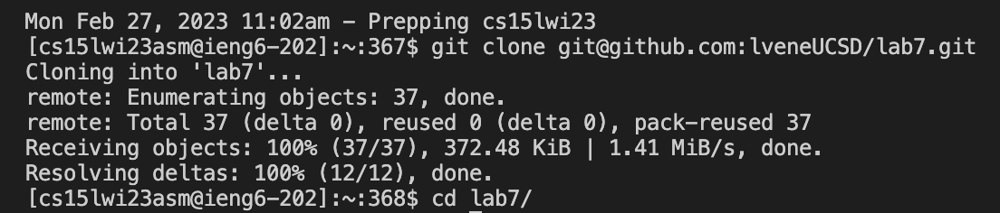
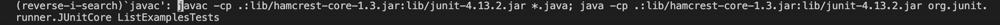
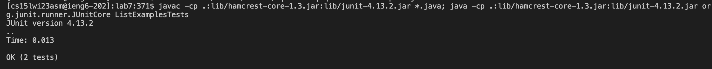
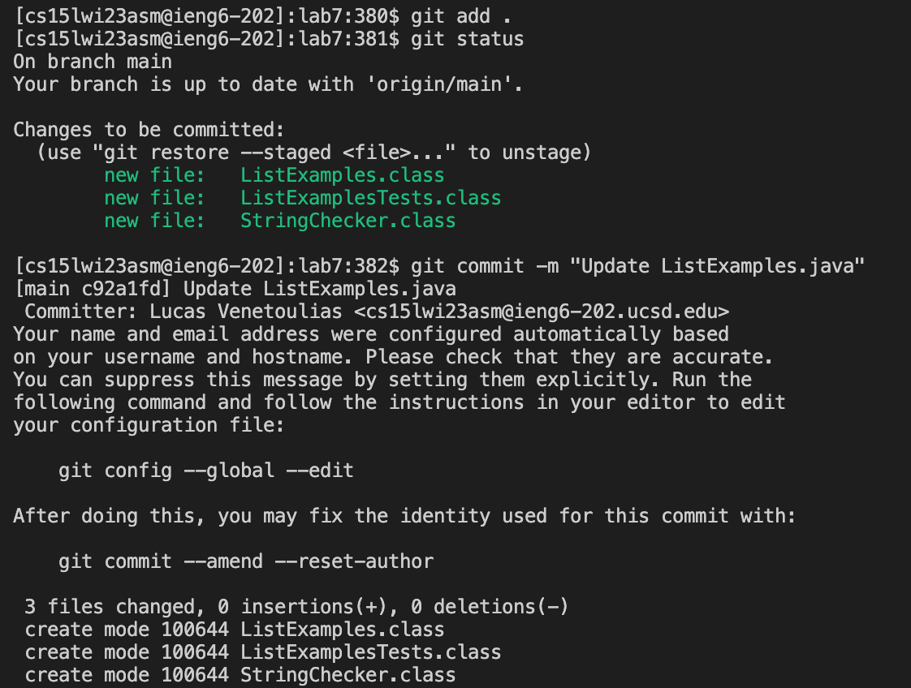
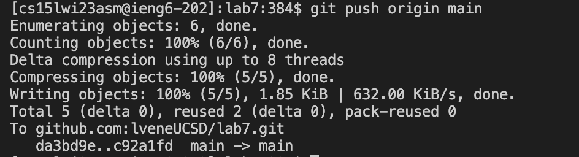

# CSE 15L, Lab Report 4: Live but Reproducible Competition
## Lucas Venetoulias 
## Feb. 27th, 2023


<ins>Part 1: Step-by-Step Instructions for Lab Competition</ins>
<br> In this lab report, I will be showcasing the exact commands I used to execute the competition assigned in lab. 

<br> **Step 4:** We were tasked with logging into ```ieng6```. Having only logged into my ```ieng6``` account once so far (in the previous run-through of the task), the ```ssh``` command I used to log in was too far back in my command history for the arrow keys to be efficient. Instead, what ran was:
<br>

To execute this command, I typed ```<Ctrl-R> ssh <enter>```. The use of ```<Ctrl-R>``` allowed me to search through my command history, and I was looking for the ```ssh``` command I last used to log into my account. I had not logged into any other account (other than my own) in this Terminal window, meaning that the ```ssh``` command my search found included the appropriate account to login.

<br> **Step 5:** We were tasked with cloning the forked repository into our ```ieng6``` accounts. To execute the appropriate command, I typed ```git clone <Command-V> <enter>```. I was able to do this because the last thing I did before the competition began was to copy the protected SSH key for my forked repository. This way, typing ```<Command-V>``` allowed me to paste the copied SSH key. Unfortunately, I did not find a way of simplifying having to type ```git clone``` in order to properly execute this command. Almost immediately after having cloned the repository, I typed ```cd l<tab> <enter>``` because the ```lab7``` directory was created in my ```ieng6``` account and, as in **Step 1**, I knew this directory was the only directory in my ```ieng6``` home directory that began with the letter "l". Using ```<tab>``` allowed me to autocomplete the command without having to type out the directory name. The full command was:


<br> **Step 6:** We were tasked with running the JUnit tests in the ```lab7``` directory. After some experimentation, some trial-and-error, and some discussion with fellow groupmates, I found a command that allowed me to compile and run the tests using only one line. However, using the arrow keys would have been largely ineffective because there were many commands that I ran since the previous call to the "compile-and-run" line. I solved the problem by inputting:
<br>

To execute this command, I typed ```<Ctrl-R> javac <enter>```. The use of ```<Ctrl-R>``` allowed me to search through my command history, and I was looking for the ```javac``` command I used to compile and run the tests. The advantage of running one line to compile and run everything meant that the last command from my command history that utilized ```javac``` was one line and executed both desired tasks. This helped improve my efficiency during the competition.

<br> **Step 7:** We were tasked with modifying the code file to fix the given issue. In my first run through, I was relatively slow in fixing the bug in ```ListExamples.java``` because I was typing ```nano L<tab> j<tab>``` and then manually finding the bug. But after a lot (and I emphasize, *a lot*) of trial and error and some discussions with other members in my group and aisle on techniques to improve efficiency, I ended up running:

Again, to execute this command, I typed ```<Ctrl-R> vim <enter>```. The use of ```<Ctrl-R>``` allowed me to search through my command history, and I was looking for a ```vim``` command I had previously run to edit the file. The ```vim``` command was extremely useful because it looks in the file given (in this case, ```ListExamples.java```), finds the line where the error is, replaces the faulty code with correct code, and then quits running. (In this case, the ```vim``` command formally replaced ```index1``` with ```index2``` in line 43.) Utilizing ```<Ctrl-R> vim``` was important for a couple of reasons: firstly, I did not have to look at the file (I did, obviously, need to look at the file the first time I was permforming this step to properly identify what the error was) and, secondly, I was sure I would not have a typo anywhere. (The ```vim``` command is long and difficult to type, meaning the chance of making a spelling mistake is higher.)

<br> **Step 8:** We were tasked with running the JUnit tests again and showing that they passed. To do this, I ran:

To execute this command, I typed ```<up><up> <enter>```. Having just run the compile-and-run line, I knew it was two commands up in my command history. In this case, using the arrow keys was more efficient way of accessing the command than using ```<Ctrl-R>```, as I had done in **Step 6**. 

<br> **Step 9:** We were tasked with committing the changes and pushing them to GitHub. To do this, I ran the following first two commands (I have included the Terminal output here to show the results as well):

To execute the first command, I typed ```git add .```. This command added *all* modified files to ```git```'s staging area, from where they will be committed and pushed to GitHub. To execute the second command, I typed ```git commit -m "Update ListExamples.java"```. This was probably the most I typed during the entire competition. I did as such because I wanted to include a relatively descriptive commit message, as this is good practice. And, to finish, I typed ```git push origin main```. Again, I did not think there was quicker way to run this command and so I resorted to simply typing it out fully. (The command to push to GitHub can be seen below.)

